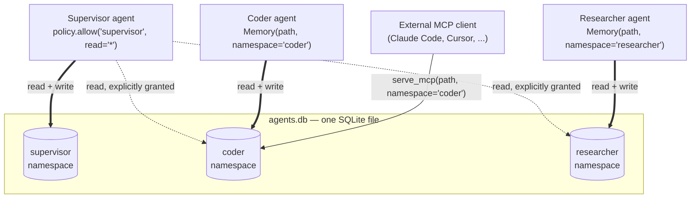

# rmbr

<!-- mcp-name: io.github.SRock44/rmbr -->

> **Give your agent memory and knowledge. One file, three lines, no server, no API key.**

`rmbr` ("remember", vowels deleted) is an embedded, local-first **memory + retrieval engine for AI agents and LLM apps** — what SQLite is to Postgres, rmbr aims to be to hosted memory services.

> **v0.2.0.** `pip install rmbr` gets you a working library: `Memory`, `Index`, `Policy`, and MCP support (below), all implemented and tested — see [docs/PLAN.md](docs/PLAN.md) and [docs/ARCHITECTURE.md](docs/ARCHITECTURE.md) for the design.

## Why

Agents can already "remember" things across restarts — a `CLAUDE.md`, a system prompt, a JSON file on disk. That's not new, and rmbr isn't claiming otherwise.

What breaks is what happens as that file grows. Every fact in a static context file costs tokens on *every single call*, whether it's relevant to the current task or not — so it either stays small (a few dozen hand-curated notes) or turns into noise nobody's cheaply reading anymore. There's no ranking: the agent gets the whole file, or nothing, never just the 5 facts that actually matter for this turn. A static file gets more expensive and less useful the more the agent learns; a searchable memory gets more useful and stays the same cost per call. `mem.recall(query)` returns the *k* most relevant memories out of however many thousand you've accumulated — that's the actual gap between "an agent that can write to a file" and "an agent with memory."

The other place people get burned: rolling this yourself. Chunk text, embed it, throw it in a vector store — that's a legitimately easy weekend project (this one started that way too). What's easy to get wrong in that weekend project: real hybrid search (most ship vector-only or keyword-only and never notice), an embedding cache (so you're not re-embedding — and re-paying for — the same text on every call), and, if there's more than one agent involved, *safe* isolation between them. Most hand-rolled or framework-provided multi-agent memory either shares one blob every agent can read and write, or scopes access via a `namespace`/`user_id` parameter the *calling model itself* supplies — which a prompt injection can simply ask to change. rmbr's MCP tools don't expose that parameter at all; there's no field for an injected instruction to fill in.

So: rmbr exists for the gap between "stuff it in a system prompt" (doesn't scale past a few KB) and "stand up real infrastructure" (Docker, a graph database, a hosted API key) — search-quality, safely-isolated memory, as a dependency, not a service.

Concretely, rmbr gives you:

- **One file.** Your agent's entire memory and knowledge base is a single `.db` file — `git commit` it, diff it, roll it back, hand it to a teammate, attach it to a bug report, or check a known-good state into a test fixture for deterministic CI. No hosted memory service lets you do any of that.
- **Three lines.** `pip install rmbr`, import, remember. No account, no config, no service.
- **No added infrastructure.** Your agent already needs a network connection and an API key for its LLM calls — rmbr doesn't add a *second* one just for memory. mem0 defaults to a hosted LLM+embedding API, Zep needs Docker+Neo4j+an LLM key, Letta needs a server+Postgres — all on top of whatever you're already paying for the model itself. rmbr's own memory/retrieval path makes zero network calls by default: one less vendor, one less key to leak, one less service whose outage takes your agent's memory down with it. (It also means rmbr keeps working with a fully local LLM — Ollama, llama.cpp — for genuinely offline or air-gapped use; most people won't need that, but it's there.)
- **No proprietary format.** rmbr never calls an LLM itself — `recall()`/`search()` return plain strings, floats, and dicts (`hit.text`, `hit.score`, `hit.metadata`). Nothing to parse, no vendor SDK required to consume it — see [Using results with an LLM](#using-results-with-an-llm) below for how that plugs into Claude, GPT, or Gemini identically.
- **Namespace-pinned multi-agent access.** `Policy` is deny-by-default; MCP tools expose no namespace parameter to override — safe by construction, not by convention.

## Quickstart

```python
from rmbr import Memory

mem = Memory("agents.db", namespace="assistant")
mem.remember("user prefers dark mode and short answers")
mem.recall("user preferences")
```

Three lines — that's the whole API for the common case. Everything below is opt-in and lives in its own section, so you only read what you actually need. Library-only by design — no CLI to learn. (`python -m rmbr` exists solely so MCP clients can launch the server; see [MCP support](#mcp-support) below.)

### Indexing documents (RAG)

```python
from rmbr import Index

idx = Index("agents.db")
idx.add_files("docs/")                     # .py, .md, and plain text each get an appropriate splitter automatically
hits = idx.search("how do I deploy?", k=5)
hits[0].text, hits[0].score, hits.timings  # per-stage latency, always visible
```

`Index` and `Memory` share the same `.db` file — open both against the same path if your agent needs a knowledge base *and* a memory. `add_files()`/`add_texts()` return an `IngestResult`: a plain list of document ids with a `.timings` breakdown attached (`chunk_ms`/`embed_ms`/`store_ms`/`ann_ms`/`docs_per_second`) — the same transparency `hits.timings` gives you for search, applied to ingestion, so you can see for yourself that embedding dominates the cost rather than take our word for it.

### Using results with an LLM

rmbr never calls a model — `search()`/`recall()` hand you back plain text and a score, and you decide what to do with it. The standard pattern (classic RAG: retrieve, then inject the retrieved text into the prompt) with Claude:

```python
from anthropic import Anthropic
from rmbr import Index

idx = Index("agents.db")
idx.add_files("docs/")

client = Anthropic()  # reads ANTHROPIC_API_KEY from the environment

def answer(question: str) -> str:
    hits = idx.search(question, k=5)
    context = "\n\n".join(f"<document>{hit.text}</document>" for hit in hits)
    response = client.messages.create(
        model="claude-sonnet-5",
        max_tokens=1024,
        # Context before the question, not after — Anthropic's own prompting
        # docs measure this ordering as meaningfully better for long-context
        # RAG, though it isn't required for correctness.
        messages=[{"role": "user", "content": f"{context}\n\nUsing the documents above, answer: {question}"}],
    )
    return response.content[0].text

answer("how do I deploy?")
```

This isn't Claude-specific. `hit.text` is a plain Python string with no wrapper, no provider object, nothing rmbr-proprietary — the exact same `context` string above drops verbatim into OpenAI's `messages` array (`client.chat.completions.create(model=..., messages=[...])`) or Gemini's `contents`. Every mainstream chat-completion API takes the same fundamental shape (a list of role-tagged text messages), which is why "retrieve text, put it in the prompt" — the only integration contract rmbr makes — works identically across providers. Swap the SDK call, nothing else changes.

Want the embedding itself to come from a hosted provider instead of the local default? `Memory("agents.db", namespace="assistant", embedder=OpenAIEmbedder())` (`pip install rmbr[openai]`) — `VoyageEmbedder`/`pip install rmbr[voyage]` and `CohereEmbedder`/`pip install rmbr[cohere]` are also available, all three behind the exact same `Embedder` protocol, same rest of the API.

### Keeping memory accurate over time

`remember()` inserting forever is fine for a while, then it isn't: near-duplicate notes pile up, and nothing ever expires. rmbr doesn't have an LLM to judge "is this the same fact" the way mem0's extraction loop does — everything below is deterministic vector-similarity/time-based engineering instead, opt-in because a false-positive match is a worse failure than a duplicate:

```python
# Update-in-place instead of appending, above a cosine-similarity threshold.
# Off by default — no LLM here to judge intent, so keep it conservative (0.92-0.95).
mem = Memory("agents.db", namespace="assistant", dedupe_threshold=0.93)
mem.remember("user prefers dark mode")       # inserts
mem.remember("user really prefers dark mode")  # updates the same row if similarity clears the bar

# Bound growth automatically (evicts the oldest beyond the cap on every remember()),
# or prune on your own schedule:
mem = Memory("agents.db", namespace="assistant", max_memories=5000)
mem.forget_older_than(60 * 60 * 24 * 30)     # delete anything older than 30 days
```

### Precision knobs for search

`search()`/`recall()` default to plain hybrid ranking, but three things are available when relevance quality matters more than the default:

```python
# Richer where= filtering: equality by default, $eq/$ne/$gt/$gte/$lt/$lte/$in/$nin as operators.
idx.search("deploy", where={"updated_at": {"$gt": "2026-01-01"}})

# A real confidence gate — filters on the raw cosine similarity (hit.vector_score),
# not hit.score itself, which is an RRF rank-sum with no fixed scale to threshold on.
idx.search("deploy", min_similarity=0.6)

# Recency-weighted ranking: a fresher memory/chunk can outrank an equally
# relevant older one. recency_weight=0.0 (off) by default. A chunk's "created"
# time is its document's ingestion time (add_text()/add_files()).
mem.recall("user preferences", recency_weight=0.05, recency_half_life_seconds=7 * 86400)
idx.search("deploy", recency_weight=0.05)

# A local cross-encoder re-scores the candidate pool for higher precision at
# extra latency — same fastembed dependency already installed, no new network
# call, no API key. hit.score becomes the cross-encoder's score when this is on.
idx.search("deploy", rerank=True)
```

### Conversation memory

The most common real agent shape is a chat loop that should remember across turns. `remember_turn()` is a thin convenience over `remember()` for exactly that — `role`/`session_id` land in metadata rather than getting baked into the stored text, so semantic search isn't polluted by a `"user: "` prefix and you can filter or replay by either:

```python
mem.remember_turn("user", "I prefer dark mode")
mem.remember_turn("assistant", "Got it, dark mode from now on", session_id="conv-42")

mem.recall("dark mode", where={"role": "user"})       # who said it
mem.list(where={"session_id": "conv-42"})              # replay one conversation, in order (list(), not recall() — no query needed)
```

### Wiring into an existing agent loop or framework

Three ways to plug rmbr into whatever's already running your agent, without going through MCP:

```python
# Raw OpenAI/Anthropic tool-calling — one line to get a ready-made tool
# definition plus a callable, in either API's shape:
tool = idx.as_tool()
response = client.messages.create(..., tools=[tool.to_anthropic()])
result = tool.call(**tool_use_block.input)          # dispatches to idx.search()

recall_tool, remember_tool = mem.as_tools()          # or as_tools(read_only=True) for recall only

# LangChain — wraps Index as a real BaseRetriever, drops into any chain
# (pip install langchain-core, or whatever LangChain distribution you're on):
retriever = idx.as_langchain_retriever(k=5)
retriever.invoke("how do I deploy?")                 # -> list[Document]

# LlamaIndex — same idea (pip install llama-index-core):
retriever = idx.as_llamaindex_retriever(k=5)
retriever.retrieve("how do I deploy?")                # -> list[NodeWithScore]
```

Both retriever adapters accept the same `search()` keyword arguments (`where=`, `min_similarity=`, `rerank=`, ...) and have async equivalents (`retriever.ainvoke(...)` / `retriever.aretrieve(...)`, backed by `Index.asearch()`). Neither `langchain-core` nor `llama-index-core` is a required rmbr dependency — each adapter imports its target framework lazily, only when you actually call `as_langchain_retriever()`/`as_llamaindex_retriever()`.

`as_tool()`/`as_tools()`'s exported schema isn't limited to `query`/`k` — a calling model can also pass `where`/`min_similarity`/`rerank` on any given call (all optional, so a model that doesn't know about them behaves exactly as before):

```python
tool.call(query="how do I deploy?", where={"tier": "public"}, min_similarity=0.6, rerank=True)
```

### Restricting access between agents

```python
from rmbr import Memory, Policy

policy = Policy()
policy.allow("supervisor", read="*")  # supervisor can read every namespace

mem = Memory("agents.db", namespace="coder", policy=policy)
```

Deny-by-default: `coder` can only read/write its own namespace unless explicitly granted. See [Multi-agent isolation](#multi-agent-isolation-honestly-stated) below for the full model, the security reasoning, and a diagram of a real team topology.

### Async, for web backends and concurrent agents

Every read and write has an `a`-prefixed async twin — `aremember`/`arecall`/`aforget` on `Memory`, `aadd_text`/`aadd_texts`/`aadd_files`/`asearch` on `Index` — for `async def` route handlers (FastAPI, Starlette, aiohttp) where a blocking call stalls every other request on the same event loop:

```python
from fastapi import FastAPI
from rmbr import Memory

app = FastAPI()
mem = Memory("agents.db", namespace="assistant")

@app.post("/chat")
async def chat(message: str):
    context = await mem.arecall(message, k=5)
    await mem.aremember(f"user said: {message}")
    return {"context": [hit.text for hit in context]}
```

Or fan a supervisor out across several granted namespaces concurrently instead of one at a time:

```python
import asyncio

coder_notes, researcher_notes = await asyncio.gather(
    supervisor.arecall("release blockers", namespaces="coder"),
    supervisor.arecall("release blockers", namespaces="researcher"),
)
```

One honestly-stated limitation: async calls on the *same* `Memory`/`Index` instance are serialized behind an internal lock, reads included. That's deliberate — the vector index (`usearch`) isn't documented as safe for concurrent mutation from multiple threads, and a corrupted index is a far worse failure than giving up some read concurrency. Open separate instances against the same file for true parallelism; SQLite's WAL mode supports that fine.

### Serving memory over MCP

```python
from rmbr import serve_mcp

serve_mcp("agents.db", namespace="coder", read_only=True)
```

See [MCP support](#mcp-support) below for what this exposes and how to actually connect a client to it.

### Contributing / running from source

```bash
git clone https://github.com/SRock44/rmbr.git
cd rmbr
python -m venv .venv && source .venv/bin/activate   # .venv\Scripts\activate on Windows
pip install --only-binary :all: -e .
pytest tests/    # 192 tests, no network or API key required
```

The default embedder (`fastembed`, a local ONNX model) downloads its model weights on first use. Every test in `tests/` instead uses `rmbr.embed.FakeEmbedder` — a deterministic, dependency-free embedder — so the suite runs fully offline; you can inject the same `FakeEmbedder` into your own tests via `Memory(..., embedder=FakeEmbedder())` / `Index(..., embedder=FakeEmbedder())`.

## Multi-agent isolation, honestly stated

- **Namespaces** keep agents' memories separate and are enforced on every call — but they are *organizational*, not cryptographic. Any code with access to the file can open the file. That's true of every embedded database; we say it out loud.
- **Hard isolation** = separate `.db` files per trust boundary, plus OS file permissions.
- **MCP serving is namespace-pinned:** the exposed tools have no namespace parameter, so an external agent structurally cannot query outside its lane — unlike every other MCP memory server we looked at, where the scope is a parameter the calling model supplies (and could be talked into changing).

A concrete team topology — one supervisor with a broad grant, two specialists that can't see each other, one external MCP client pinned to a single lane, all in the same `agents.db` file:



The coder and researcher namespaces have no path between them on this diagram — that's the point, not an omission. Nothing needed to be configured to deny that access; only the supervisor's grant (`read="*"`) is explicit. The external MCP client's tool schema has no `namespace` argument at all, so it structurally cannot ask for anything outside `coder`, no matter what a document it's summarizing tells it to try.

## MCP support

[MCP](https://modelcontextprotocol.io) (Model Context Protocol) is an open, model-agnostic protocol for connecting AI applications — Claude Desktop, Claude Code, Cursor, and a growing list of others — to external tools and data sources through one standard interface, instead of every app inventing its own plugin format. rmbr speaks MCP so any MCP-capable client can search and remember through your `.db` file directly, without you writing a server yourself.

### What `serve_mcp()` exposes

```python
from rmbr import serve_mcp

serve_mcp("agents.db", namespace="coder")                  # read + write
serve_mcp("agents.db", namespace="coder", read_only=True)  # read only
```

Three tools, all pinned to whatever namespace you pass at startup (see [Multi-agent isolation](#multi-agent-isolation-honestly-stated) above for why there's no namespace parameter for a client to override):

- **`search(query, k=5)`** — hybrid search over documents added via `Index`
- **`recall(query, k=5)`** — search over notes saved via `Memory`
- **`remember(text)`** — save a new memory. Not present in the tool list at all — not just permission-denied — when `read_only=True`.

Each result includes `bm25_score`/`vector_score` (the raw signals behind `score`) alongside `text`/`metadata` — useful if the calling agent wants to weight or filter results by confidence rather than trust every hit equally. `min_similarity`, `recency_weight`, and `rerank` (see [Precision knobs for search](#precision-knobs-for-search) above) aren't exposed as MCP tool parameters yet — the tool schemas stay minimal on purpose; configure them at `serve_mcp()`'s call site via a custom `Index`/`Memory` if you need them server-side.

### Connecting a client

`serve_mcp()` blocks on stdio; it's meant to be launched as a subprocess by an MCP client, not called from inside your own long-running app. `python -m rmbr` is the launch shim for exactly that (the package also installs a `rmbr` console script pointing at the same thing, so `uvx rmbr` works without a local install):

```bash
python -m rmbr agents.db --namespace coder --read-only
# or, via the installed console script / uvx:
rmbr agents.db --namespace coder --read-only
```

For Claude Desktop or Claude Code, add it to your MCP config (Claude Desktop's `claude_desktop_config.json`, or a project's `.mcp.json`):

```json
{
  "mcpServers": {
    "rmbr-coder": {
      "command": "uvx",
      "args": ["rmbr", "/absolute/path/to/agents.db", "--namespace", "coder", "--read-only"]
    }
  }
}
```

Restart the client and its tool list picks up `search`/`recall` (and `remember`, unless read-only) scoped to that one namespace. The rest of the file — every other agent's memory — isn't reachable through this connection; there's no parameter that would let it be.

## Alternatives

Not "competitors" — genuinely different tools for genuinely different jobs. Here's where each one actually fits, including where rmbr *isn't* the right choice.

**If you're evaluating a memory service** (mem0, Zep/Graphiti, Letta): all three are excellent at LLM-mediated memory intelligence — extracting facts from conversation, resolving contradictions, consolidating duplicates. rmbr deliberately does none of that; it never calls an LLM, full stop. That's a real capability gap, not spin — but it's also why rmbr has no API key requirement, no extra LLM cost or latency on every `remember()`, and no risk of a consolidation model quietly rewriting what you actually said. You get the primitives (`remember`/`recall`/`forget`, namespace policy); you decide what, if anything, sits on top.

| | mem0 | Zep / Graphiti | Letta | rmbr |
|---|---|---|---|---|
| Deployment | SDK, but calls a hosted LLM + embedding API by default | Docker + Neo4j/FalkorDB + an LLM API | A server (Docker) + Postgres | Embedded — one file, your process |
| API key required out of the box | Yes (OpenAI) | Yes (LLM for graph extraction) | Yes (LLM) | No |
| Decides what's worth remembering | An LLM (fact extraction) | An LLM (graph edges, contradiction resolution) | An LLM (self-editing memory blocks) | You do — deterministic, no LLM in the write path |
| State is a portable file | No | No | No | Yes |

(GitHub stars as of this writing, for scale: mem0 ~62k, Graphiti ~29k, Letta ~24k. This is a much larger, faster-moving category than rmbr is part of — worth knowing going in.)

**If you're evaluating a vector database** (Chroma, LanceDB, pgvector, Pinecone, ...): these are real peers on "embedded, no API key" — Chroma and LanceDB in particular are just as zero-server as rmbr. The difference is what's built on top of the vector index: with a raw vector database you're still building the memory API, the namespace/access-control layer, the hybrid BM25+vector fusion, the embedding cache, and an MCP server yourself. rmbr ships all of that already assembled, specifically for the agent-memory shape of problem.

Where they legitimately win: **raw bulk-ingestion throughput at large scale.** If you're indexing millions of documents for a dedicated search product, use a purpose-built vector database — that's their job, not rmbr's. rmbr is tuned for what an agent's own memory and knowledge base actually looks like (its own history, a knowledge base in the hundreds-to-low-thousands of chunks), where single-call latency, not bulk-loading speed, is what you actually pay for on every turn. See [Performance](#performance) below for the honest numbers on both.

## Performance

**This README will never contain a performance number that isn't produced by a script in `bench/`** — reproducible by anyone, on disclosed hardware, methodology included.

The number that matters for rmbr's actual usage pattern — an agent calling `remember()`/`search()` one at a time mid-reasoning-loop, not bulk-loading a corpus — is **single-call latency with the real default embedder**, not bulk throughput. That's what's below, run on the project's pinned Ubuntu benchmark machine (Intel Core Ultra 9 285K, 4 cores isolated via `taskset -c 0-3`, Ubuntu 24.04.4 LTS, Python 3.12.3), median of 3 runs, 100 samples/run:

| operation | p50 | p95 | p99 |
|---|---:|---:|---:|
| `mem.remember(text)` | 5.8 ms | 11.1 ms | 11.5 ms |
| `idx.search(query, k=5)` against a 500-doc index | 3.2 ms | 4.1 ms | 4.2 ms |
| — of which, query embedding alone | 2.8 ms | 3.1 ms | 3.3 ms |

Read that last row carefully: **~85-90% of a search call's cost is the embedding model, not rmbr.** rmbr's own storage/retrieval overhead is sub-millisecond. And all of this is imperceptible next to the LLM call that will follow it in any real agent loop — which was rmbr's founding thesis about where RAG latency actually lives (see [docs/PLAN.md](docs/PLAN.md)). Reproduce: `python bench/latency.py`; raw output for all 3 runs is in [`bench/pinned/`](bench/pinned/).

**Bulk-ingest throughput, for full transparency (not a claim we're leading with):** rmbr batches every write in `add_texts()`/`add_files()` into one SQLite transaction, one embedder call, and one ANN-index insert for the whole batch, rather than once per document — a real, measured improvement from 950 to ~3,000 docs/s on a 5,000-doc synthetic corpus. Note what didn't move much: batching the embed call barely helped *in this specific benchmark*, because it feeds every engine identical precomputed vectors (a near-free dict lookup) specifically to isolate storage/ANN performance — a real embedder (ONNX inference, or an API call) has real fixed per-call overhead that batching actually amortizes, so `bench/latency.py`'s numbers above are the more representative ones for real-world embedding cost. Even after this, rmbr is still slower at pure bulk loading than both purpose-built alternatives: Chroma ingests ~2.6x faster (~7,850 docs/s) and LanceDB ~20-55x faster (~65,000-165,000 docs/s, wide variance across runs), because that's a fundamentally different job (one Arrow batch write, zero per-row relational bookkeeping, in LanceDB's case) than what rmbr is built for. What rmbr does hold its own on: recall@5 (0.95) is competitive with LanceDB's exact search (1.0) and ahead of Chroma's (0.80). Full numbers, all 3 seeds, in [`bench/pinned/`](bench/pinned/) and reproducible via `pip install -e ".[bench]" && python bench/run.py`. We're disclosing this, not hiding it: if bulk document loading at scale is your actual workload, see [Alternatives](#alternatives) above — that's not what rmbr optimizes for.

### Why `bge-small-en-v1.5` is still the default

We tested. `bench/quality.py` measures recall@1 on 150 hand-written (query, correct passage, distractors) examples — 50 each spanning remembered preferences, documentation, and code, the actual shapes of content rmbr indexes — against every same-size-class local embedding model `fastembed` supports, plus `bge-base-en-v1.5` as a "what does 3x the size buy you" reference point:

| model | size | overall recall@1 |
|---|---:|---:|
| **bge-small-en-v1.5 (default)** | 67MB | 0.760 |
| snowflake-arctic-embed-xs/s | 90-130MB | 0.647-0.673 |
| all-MiniLM-L6-v2 / jina-v2-small | 90-120MB | 0.767 |
| bge-base-en-v1.5 (3x the size) | 210MB | 0.833 |

Nothing in bge-small's own size class beats it with any real confidence — the alternatives above land within about a point of it, which is noise at this sample size. The only model that wins by a real margin is `bge-base-en-v1.5`: +7.3 points recall@1, at a real, measured cost — 3x the download (210MB) and ~3.9x the per-embed latency (7.5ms vs 1.9ms p50, both still small in absolute terms). We tested that tradeoff and kept the smaller, faster model as the default; if you want the quality bump and don't mind the size, it's a one-line change:

```python
from rmbr.embed import FastEmbedEmbedder
mem = Memory("agents.db", namespace="assistant", embedder=FastEmbedEmbedder(model_name="BAAI/bge-base-en-v1.5"))
```

Full data and every candidate's per-category breakdown: `python bench/quality.py --models candidates`.

## Roadmap

- **v0.1** — `Memory` + `Policy` + `Index` (hybrid BM25 + vector search, metadata filtering), embedding + semantic query caches, MCP support (namespace-pinned), 3-OS CI (Linux/Windows/macOS), true batch ingestion with per-stage timings, async API surface (`a`-prefixed methods), a Python-aware chunker (stdlib `ast`, no added dependency), one hosted embedding provider (OpenAI), a 150-example quality eval that confirmed the default embedder against local alternatives, real single-call and bulk benchmark numbers, PyPI trusted publishing, a `uvx`-launchable console script, and a listing on the [official MCP registry](https://registry.modelcontextprotocol.io)
- **v0.2** — similarity-based memory dedupe/update (`dedupe_threshold`), bounded retention (`max_memories`, `forget_older_than`), recency-weighted ranking for both `Memory.recall()` and `Index.search()`, richer `where=` filtering (`$gt`/`$gte`/`$lt`/`$lte`/`$in`/`$nin`/`$ne`, not just equality, now also usable on `Memory.list()`), a real confidence gate on raw cosine similarity (`min_similarity`, plus `hit.bm25_score`/`hit.vector_score` on every result), an optional local cross-encoder reranker (`rerank=True`), a conversation-memory convenience (`remember_turn()`), tool-calling export for hand-rolled agent loops (`as_tool()`/`as_tools()`, OpenAI- and Anthropic-shaped, exposing the full `where`/`min_similarity`/`rerank` knob set — not just `query`/`k`), LangChain/LlamaIndex retriever adapters (`as_langchain_retriever()`/`as_llamaindex_retriever()`, both optional/lazy-imported), two more hosted embedding providers (`VoyageEmbedder`, `CohereEmbedder` — same `Embedder` protocol as `OpenAIEmbedder`), and two more auto-detected chunkers (`split_json`, `split_rst`, both stdlib-only)
- **Known gaps** — none carried over from v0.1's list; nothing new opened yet
- **Next** — a pluggable consolidation hook (`mem.consolidate(extractor)`): rmbr still never calls an LLM itself, but a caller-supplied extractor callable would let rmbr orchestrate mem0-style fact extraction/dedup/update against your own model choice, without rmbr owning an API key. Design in progress, not yet built.

## License

[MIT](LICENSE)
